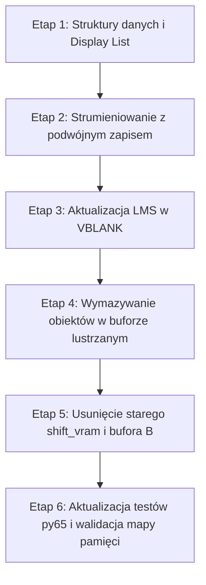

# Plan Implementacji: Mirror Ring Buffer & Per-Row LMS

## 1. Cel architektury i oczekiwane zyski
* **Eliminacja kopiowania VRAM:** Usunięcie pętli [`shift_vram_left`](file:///c:/Users/grzes/Documents/Projects/jabberwocky/scenes/game.asm#L2588) (~4 900 cykli CPU co krok koarsowy).
* **Nowy koszt przewijania:** 22 zapisy pamięci (11 wierszy × 2 kopie kolumny) + aktualizacja 11 wskaźników LMS w VBLANK = **~230 cykli CPU** (spadek narzutu o **~95%**).
* **Uproszczenie potoku:** Rezygnacja z klasycznego podwójnego buforowania całego pola akcji (Buffer A / Buffer B) – brak ryzyka tearingu, ponieważ nowa kolumna dopisywana jest na niewidocznym marginesie bufora.

---

## 2. Nowy układ pamięci VRAM i Display List

### A. Organizacja pamięci VRAM (1 056 bajtów)
* Plansza ma 11 wierszy w trybie ANTIC Mode 5.
* Szerokość logiczna wiersza wynosi 48 bajtów (40 widocznych + 8 marginesu dla HSCROL).
* Każdy wiersz w buforze ma szerokość **96 bajtów** (48 bajtów danych + 48 bajtów dokładnej kopii lustrzanej):
  ```
  Wiersz 0:  [$6000 .. $602F] [Kopia: $6030 .. $605F] (96 B)
  Wiersz 1:  [$6060 .. $608F] [Kopia: $6090 .. $60BF] (96 B)
  ...
  Wiersz 10: [$63C0 .. $63EF] [Kopia: $63F0 .. $641F] (96 B)
  ```
* **Granica 4 KB ANTIC:** Cały bufor zajmuje obszar `$6000–$641F` (1 056 bajtów) – mieści się z zapasem wewnątrz jednego bloku 4 KB (`$6000–$6FFF`), więc żaden odczyt LMS nigdy nie naruszy ograniczenia 4 KB.
* **Relokacja paska statusu:** `GAME_STATUS_VRAM` (80 B) zostanie umieszczony pod adresem `$6420–$646F` (w zwolnionej przestrzeni po dawnym buforze B).

### B. Modyfikacja Display List (`dlist_game`)
W [`main.asm`](file:///c:/Users/grzes/Documents/Projects/jabberwocky/main.asm#L337) sekcja pola akcji zostanie zmieniona z 1 LMS + 10 linii na **11 niezależnych instrukcji LMS**:
```asm
dlist_game_action_lms
    dta DL_MODE_5 | DL_LMS | DL_HSCROL, a(RING_VRAM_ROW0)
    dta DL_MODE_5 | DL_LMS | DL_HSCROL, a(RING_VRAM_ROW1)
    ...
    dta DL_MODE_5 | DL_LMS | DL_HSCROL, a(RING_VRAM_ROW10)
```
Rozmiar Display List wzrośnie o 20 bajtów (10 dodatkowych adresów LMS), co bez problemu mieści się w segmencie `DLIST_ADDR` ($6610).

---

## 3. Algorytm przewijania i strumieniowania

### A. Rejestr przesunięcia kołowego (`ring_col_offset`)
* Wprowadzamy zmienną `ring_col_offset` (wartości `0..47`).
* Przy każdym kroku koarsowym (gdy akumulator prędkości przekracza `$0400`):
  1. `ring_col_offset = (ring_col_offset + 1)`
  2. Jeśli `ring_col_offset == 48`, następuje zawinięcie: `ring_col_offset = 0`.

### B. Podwójny zapis kolumny w `stream_screen_col`
Gdy do ekranu wpływa kolejna kolumna ze zdekodowanego ekranu źródłowego:
1. Obliczamy fizyczną pozycję kolumny zapisu w buforze: `write_col = (ring_col_offset + 47) % 48`.
2. Dla każdego z 11 wierszy zapisujemy pobrany kafelek pod adres:
   - `ROW_BASE[row] + write_col`
   - `ROW_BASE[row] + write_col + 48` (kopia lustrzana)
3. Zamiast pętli kopiującej cały ekran, wykonujemy 11 par zapisów `STA`.

### C. Atomowa aktualizacja wskaźników LMS w VBLANK
W przerwaniu [`vblank_game`](file:///c:/Users/grzes/Documents/Projects/jabberwocky/scenes/game.asm#L1284):
* Zamiast zmieniać pojedynczy adres `dlist_game_action_lms + 2`, aktualizujemy młodsze bajty adresów w 11 wierszach DLIST:
  $$\text{LMS\_ADDR}[row] = \text{ROW\_BASE}[row] + \text{ring\_col\_offset}$$
* Dzięki pre-kalkulowanej tabeli starszych i młodszych bajtów dla 11 wierszy, aktualizacja w VBLANK zajmie zaledwie ~60–80 cykli CPU.

---

## 4. Wpływ na mechanikę gry i pozostałe moduły

### A. Niszczenie przeszkód ogniem i zbieranie sekretów (`erase_cur_object`)
* Gdy płomień smoka trafia obiekt lub gracz zbiera sekret, funkcja [`erase_cur_object`](file:///c:/Users/grzes/Documents/Projects/jabberwocky/engine/flame_collision.asm#L725) wymazuje kafle z VRAM (wstawia znaki `$00`).
* **Zmiana:** Funkcja wymazywania przelicza kolumnę ekranową na pozycję w buforze kołowym `vram_col = (screen_col + ring_col_offset) % 48` i czyści kafelek **w obu połówkach**:
  `VRAM[row][vram_col] = 0` oraz `VRAM[row][vram_col + 48] = 0`.
  Zapobiega to "odrodzeniu się" zniszczonego obiektu po wykonaniu pełnego obrotu bufora.

### B. Kolizje smoka ze ścianami (`blocking_col8` / `blocking_col9`)
* **Brak konieczności zmian!** Smok leci na stałej pozycji poziomej (kolumny 8 i 9).
* Silnik kolizji operuje na dedykowanych, 11-bajtowych buforach kolumn [`blocking_col8` i `blocking_col9`](file:///c:/Users/grzes/Documents/Projects/jabberwocky/engine/flame_collision.asm#L73), które są strumieniowane niezależnie od VRAM. Ta część pozostaje w 100% nienaruszona.

### C. Wypiekanie ekranów (`bake_screen`)
* Staging buffery `screen_buf_a_vram` i `screen_buf_b_vram` (440 B) oraz mechanizm odroczonego wypieku ([`execute_pending_bake`](file:///c:/Users/grzes/Documents/Projects/jabberwocky/scenes/game.asm#L2516)) pozostają bez zmian. Ekran nadal wypieka się do bufora tymczasowego raz na 40 kolumn, skąd nowa kolumna jest strumieniowana do bufora kołowego.

---

## 5. Etapy wdrożenia (Krok po kroku)



1. **Etap 1: Struktury danych i Display List ([`main.asm`](file:///c:/Users/grzes/Documents/Projects/jabberwocky/main.asm))**
   - Zdefiniowanie adresu bazowego `RING_ACTION_VRAM = $6000` (1 056 B) oraz relokacja `GAME_STATUS_VRAM = $6420`.
   - Rozbudowa `dlist_game` do 11 wierszy z instrukcjami `DL_MODE_5 | DL_LMS | DL_HSCROL`.
   - Przygotowanie tablic adresowych `ring_row_base_lo` i `ring_row_base_hi` (po 11 bajtów).

2. **Etap 2: Podwójny zapis w strumieniowaniu ([`scenes/game.asm`](file:///c:/Users/grzes/Documents/Projects/jabberwocky/scenes/game.asm))**
   - Dodanie zmiennej `ring_col_offset`.
   - Zastąpienie gałęzi `@stream_buf_a` / `@stream_buf_b` nową procedurą `stream_ring_col`, wykonującą zapis do `col` i `col + 48`.

3. **Etap 3: Aktualizacja wskaźników LMS w VBLANK ([`scenes/game.asm`](file:///c:/Users/grzes/Documents/Projects/jabberwocky/scenes/game.asm))**
   - Wdrożenie procedury `update_ring_dlist_lms` w `vblank_game`.
   - Usunięcie flagi `vram_swap_pending` i mechanizmu podmiany Buffer A/B.

4. **Etap 4: Dostosowanie wymazywania obiektów ([`engine/flame_collision.asm`](file:///c:/Users/grzes/Documents/Projects/jabberwocky/engine/flame_collision.asm))**
   - Modyfikacja `erase_cur_object` do podwójnego czyszczenia komórek w oparciu o `ring_col_offset`.

5. **Etap 5: Czyszczenie kodu i usunięcie przestarzałych procedur**
   - Całkowite usunięcie procedur `shift_vram_left`, `shift_vram_a_to_b`, `shift_vram_b_to_a`.
   - Usunięcie bufora `GAME_ACTION_VRAM_B` z mapy pamięci.

6. **Etap 6: Aktualizacja testów emulacyjnych i weryfikacja ([`tests/`](file:///c:/Users/grzes/Documents/Projects/jabberwocky/tests/))**
   - Zaktualizowanie asercji w [`tests/test_scrolling.py`](file:///c:/Users/grzes/Documents/Projects/jabberwocky/tests/test_scrolling.py) (testowanie wskaźników LMS w DLIST i bufora lustrzanego zamiast Buffer A/B swap).
   - Zaktualizowanie adresów VRAM w [`tests/test_flame_collision.py`](file:///c:/Users/grzes/Documents/Projects/jabberwocky/tests/test_flame_collision.py).
   - Uruchomienie `make all` i pełnego pakietu `pytest` (187 testów).

---

## 6. Punkty kontrolne i mitygacja ryzyk

| Ryzyko | Potencjalny skutek | Rozwiązanie / Mitygacja |
| :--- | :--- | :--- |
| **Przekroczenie granicy 4 KB ANTIC** | Zniekształcenie grafiki (glitch rastra) | Bufor `$6000–$641F` mieści się w całości wewnątrz strony `$6000–$6FFF`. Asercja w asemblerze: `.if (>RING_ACTION_VRAM) != (> (RING_ACTION_VRAM + 1055)) .error .endif`. |
| **Wyciek pamięci / kolizja segmentów** | Nadpisanie kodu lub czcionki | Wykorzystanie przestrzeni dawnego bufora B (`$6400–$660F`) na status bar i wolny margines. Walidacja przez `scripts/check_memory.py`. |
| **Desynchronizacja wymazywania obiektów** | "Odradzanie się" zniszczonych drzew/ścian | Test jednostkowy py65 sprawdzający wymazanie komórki na pozycji `X` oraz `X + 48` po strzale z płomienia. |